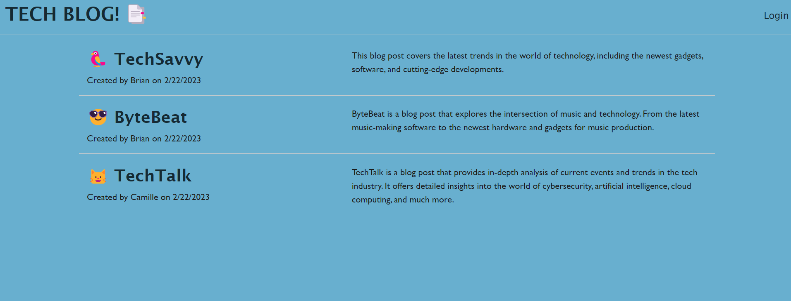
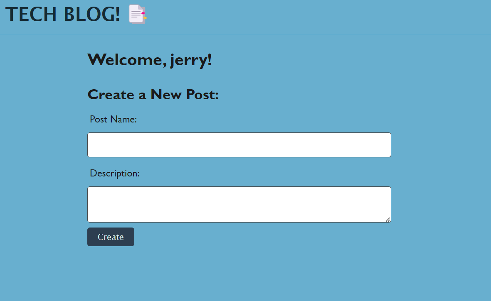
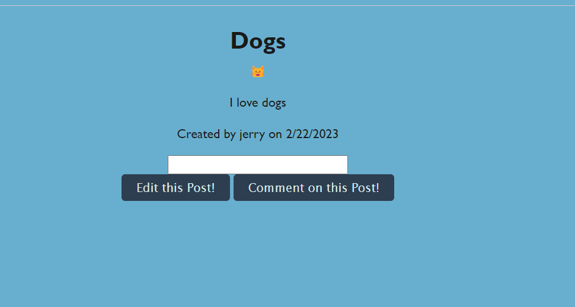

# tech-blog
 ## Description
   My Tech Blog is a simple blogging platform. It provides an easy-to-use interface for creating, editing, and publishing blog posts. Users can also leave comments on posts and engage in discussions.

  ## Usage
Once the server is running, you can access the application by visiting http://localhost:3001 in your browser. You can create a new account by clicking on the "Sign up" button and filling out the registration form.

Once you are logged in, you can create a new post by clicking on the "New Post" button. You can also edit or delete your existing posts from the "My Profile" page.

To leave a comment on a post, click on the post title to view the full post and then enter your comment in the comment box below.

  ## Visual

